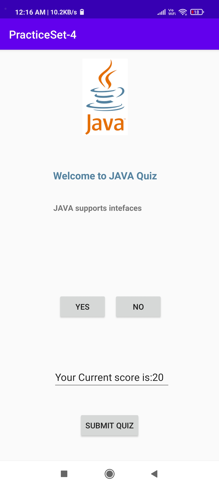
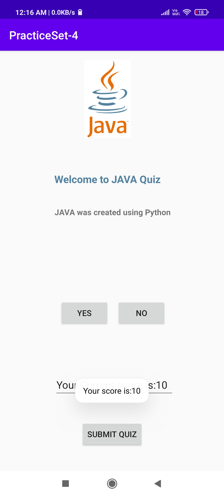
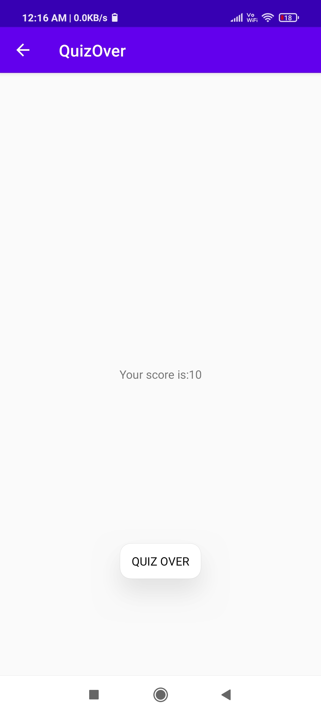

# JAVA-QUIZ-APP
A QUIZ APP BASED ON FUNDAMENTALS OF JAVA WHERE USER CAN CLICK ON NO/YES BUTTON AND SCORE WILL GET INCREASED +10 FOR EVERY CORRECT ANSWERS .IF USER WANTS TO SUBMIT QUIZ BEFORE COMPLETING IT IT CAN BE DONE BY CLICKING "SUBMIT BUTTOM".FURTHUR ON COMPLETING QUIZ NEW WINDOW OPENS SHOWING THE FINAL MARKS.

&nbsp;
  &nbsp;
  &nbsp;
  &nbsp;
  &nbsp;
  &nbsp;
  &nbsp;
  &nbsp;
 

&nbsp;
  &nbsp;
  &nbsp;
  &nbsp;
  &nbsp;
  &nbsp;
  &nbsp;
  &nbsp;

